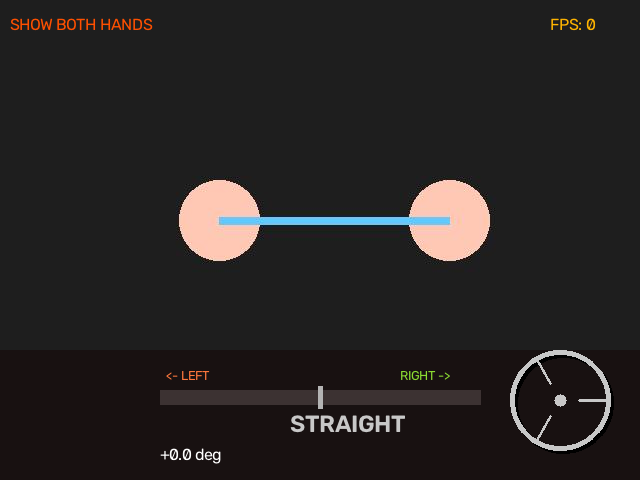

# 🚗 Virtual Steering Wheel

A real-time computer vision project that lets you control a virtual steering wheel using your hand movements.

---

## ✨ Features

- ✋ Real-time hand tracking
- 🚗 Virtual steering wheel
- 📷 Webcam support
- ⚡ Fast detection using MediaPipe
- 🎯 Steering angle calculation
- 💻 Easy to run

---

## 🛠 Tech Stack

- Python
- OpenCV
- MediaPipe
- NumPy

---

## 📷 Demo

### Hand Detection


### Steering Output



### Debug View


---

## 📂 Project Structure

```text
virtual-steering-wheel/
│
├── images/
│   ├── capture_debug.jpg
│   ├── sample_hand.jpg
│   └── test_output.png
│
├── steering_wheel.py
├── requirements.txt
├── README.md
├── .gitignore
└── hand_landmarker.task
```

---

## 🚀 Installation

Clone the repository

```bash
git clone https://github.com/LENGND123/steering-wheel.git
```

Go into the project folder

```bash
cd steering-wheel
```

Install dependencies

```bash
pip install -r requirements.txt
```

Run

```bash
python steering_wheel.py
```

---

## 📌 Requirements

- Python 3.10+
- Webcam
- MediaPipe
- OpenCV

---

## 👨‍💻 Author

**Aditya Raj Singh**

GitHub: https://github.com/LENGND123

---

⭐ If you found this project helpful, please give it a star!
